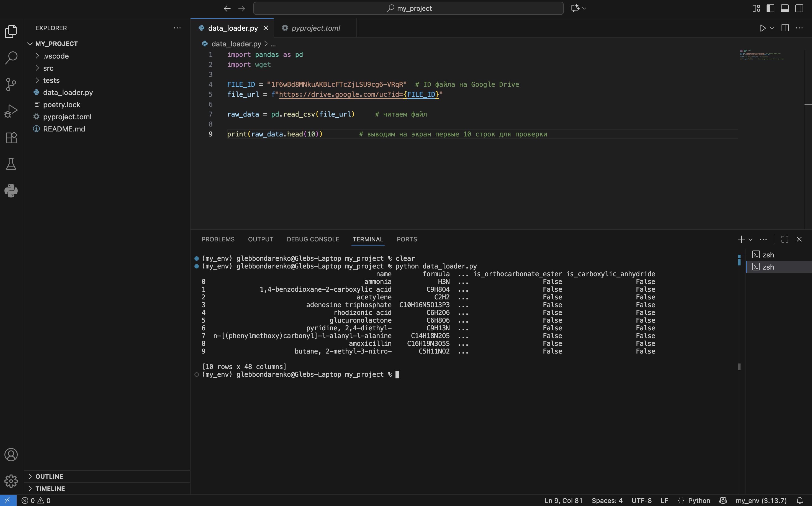

# Data Engineering: Physical and Chemical Properties of Substances

This repository contains dataset, scripts, and tools for working with the physical and chemical properties of substances. The goal of the project is to process, analyze, and visualize scientific data for educational purposes.


# Dataset
https://drive.google.com/file/d/1F6wBd8MNkuAKBLcFTcZjLSU9cg6-VRqR/view?usp=sharing


# How to run code
1. Clone repository:
   ```bash
   git clone https://github.com/Gleb-Bondarenko/data-engineering-phys-chem-properties.git
   cd data-engineering-phys-chem-properties
2. Create a virtual environment and install dependencies via Poetry
   ```bash
   conda create -n my_env python=3.13 pip
   conda activate my_env
   
   pip install poetry
   poetry install --no-root
3. Run code
   ```bash
   python3 data_loader.py

# The data_loader.py command produces the following output:


In the src/api_example folder, there is a script that retrieves data from a public API and converts it into a Pandas DataFrame.

In the src/api_example folder, there is a script that retrieves data from a public API and converts it into a Pandas DataFrame.

# Source
https://www.kaggle.com/datasets/ivanyakovlevg/physical-and-chemical-properties-of-substances
