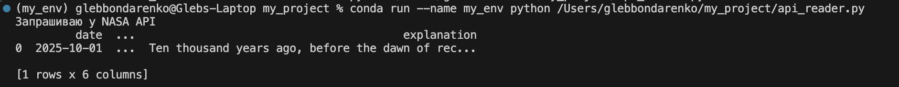
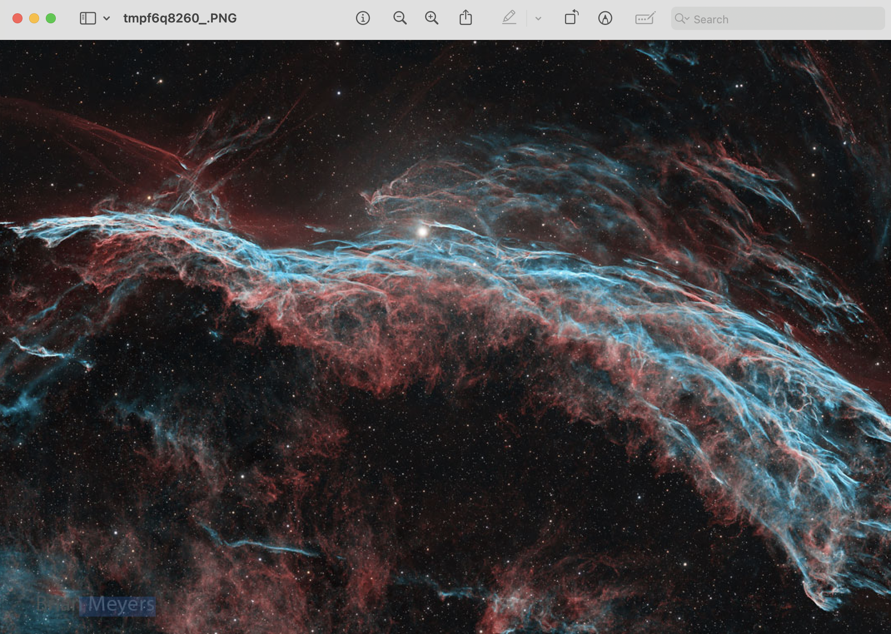

# API Example — NASA Open API APOD

Используется публичный API: [https://api.nasa.gov/planetary/apod](https://api.nasa.gov/planetary/apod)

Скрипт `api_reader.py` загружает фотографию и описание космического объекта и сохраняет их в `Pandas DataFrame`.

## Пример вывода

