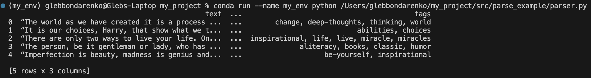

# Parser Example — Quotes to Scrape

Данные парсятся с сайта [https://quotes.toscrape.com](https://quotes.toscrape.com)

Скрипт `parser.py` собирает цитаты, авторов и теги, загружает их в `Pandas DataFrame` и выводит первые строки

## Пример вывода

